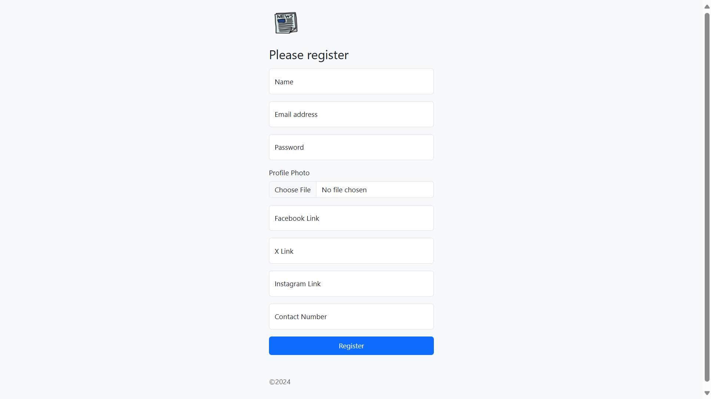

# News Daily - Servlet Based Web Application

## Description

This is a simple web application that displays news articles from a database. The application is built using Java Servlets and JSPs. The application is built using the MVC architecture.

## Features

- Display news articles
- Search for news articles

## Technologies

- Java Servlets
- JSP
- MySQL
- HTML
- CSS
- JavaScript

## Installation

1. Clone the repository
2. Create a MySQL database and import the `news.sql` file
3. Update the database connection details in the `DBConnection.java` file
4. Run the application on a server

## Usage

- Open the application in a web browser
- View news articles
- Search for news articles

## Screenshots

## Demo Video

## License

This project is licensed under the MIT License - see the [LICENSE](LICENSE.md) file for details

## Author

- [Divya Shah](https://github.com/divyashah0510)
